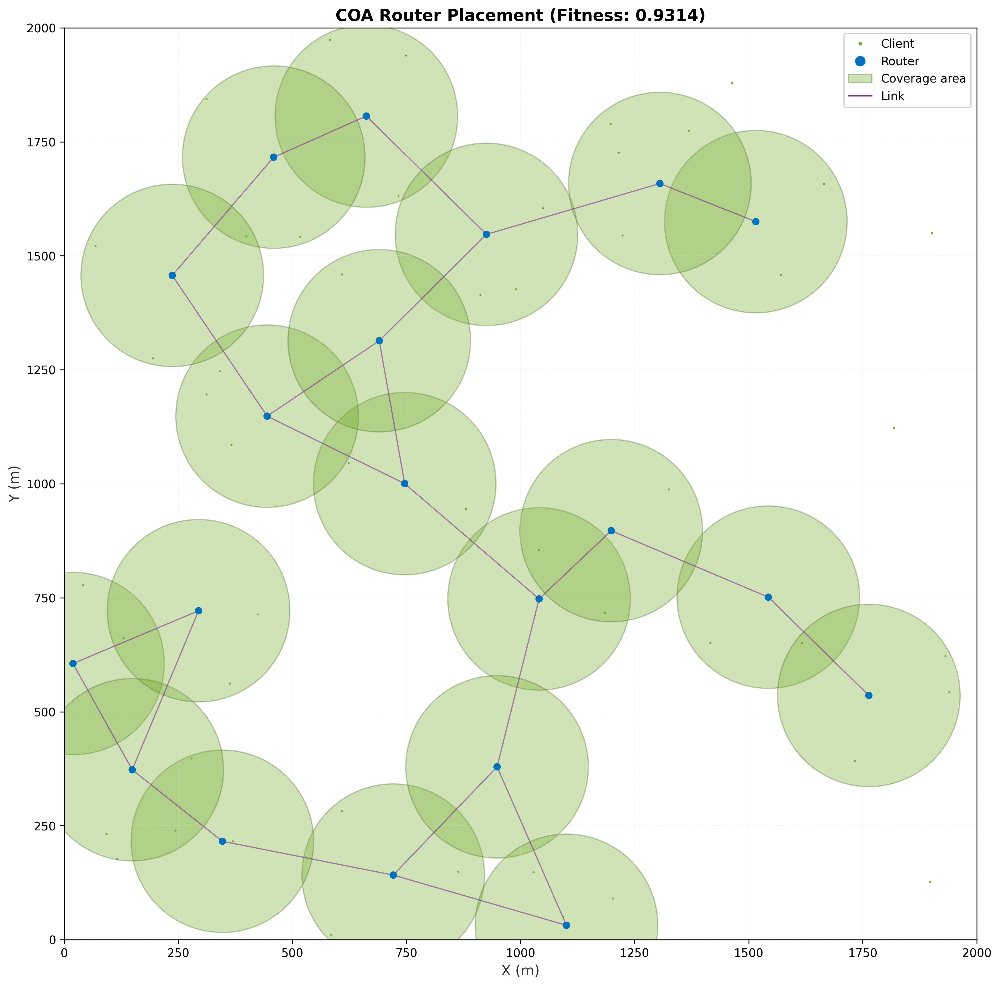
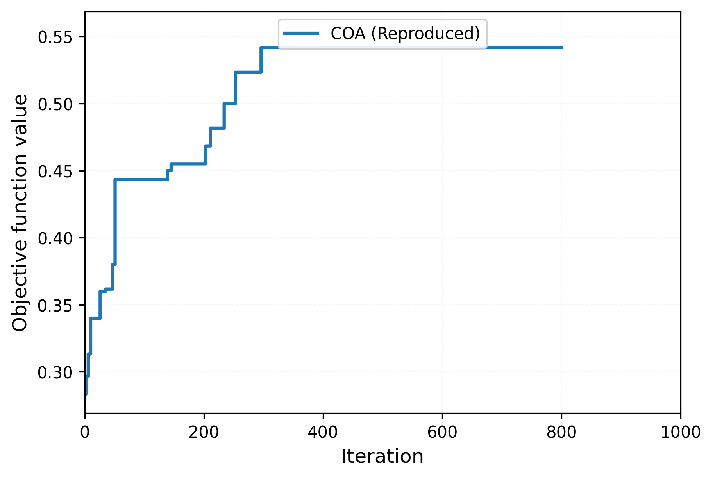
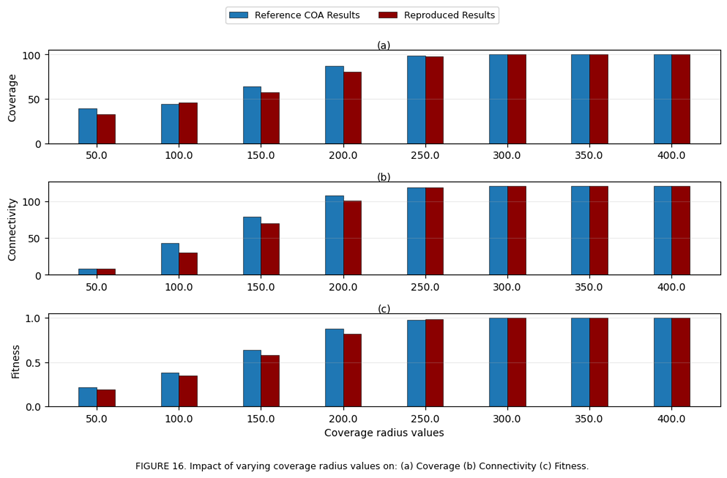

# COA for WMN Router Placement

This project was done for a course. It implements router placement optimization in Wireless Mesh Networks using the Coyote Optimization Algorithm (COA).

## Project Structure

```
BBL512E_COA_WMN/
├── scripts/              # Execution scripts
├── src/wmn/              # Main code modules
├── results/              # Results (tables, figures)
│   ├── figures/         # Figures
│   ├── tables/          # Tables 
│   └── logs/            # Log files
└── requirements.txt      # Requirements
```

## Installation

```bash
pip install -r requirements.txt
```

## Usage

### Basic Placement
```bash
python scripts/run_placement.py
```

### Convergence Analysis
```bash
python scripts/run_convergence.py
python generate_convergence_figures.py
python make_table11.py
```

### Parameter Sweep Experiments
```bash
python scripts/run_clients_sweep_parallel.py    # Client count sweep
python scripts/run_routers_sweep_parallel.py    # Router count sweep
python scripts/run_radius_sweep_parallel.py     # Coverage radius sweep
```

## Results

Results are in the `results/` folder:
- **figures/**: Convergence plots and placement visualizations
- **tables/**: Experiment results (in CSV format)

### Example Results







## Notes

- All experiments are accelerated with parallel processing
- Results are compared with reference values from the paper
- Detailed logs are available in the `results/logs/` folder
